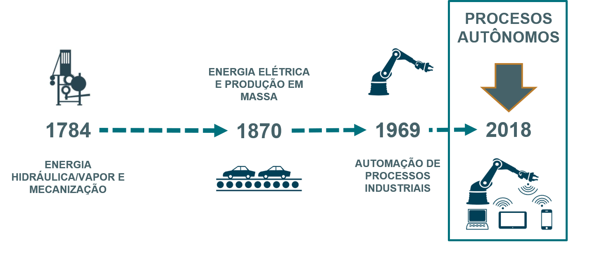
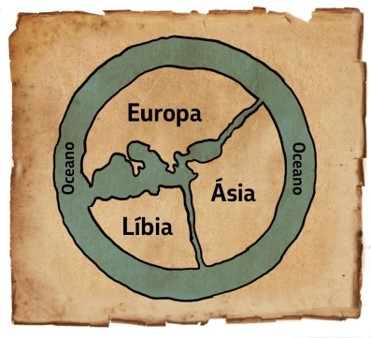
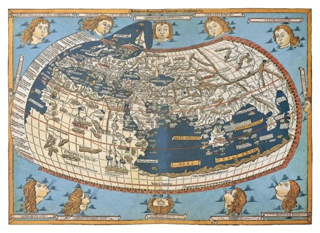

```{r setup, include=FALSE, fig.align = "center"}
options(htmltools.dir.version = FALSE)
```
class: center, middle

# SEJAM BEM VINDOS!

---
class: inverse, center, middle

# Urbanização, noções de urbano e rural e definição de cidades

---
# Urbanização
```{r , echo=FALSE, fig.cap="A caption", out.width = '99%', fig.align = 'center'}

```

---
# Urbanização   

- Primeiros assentamentos europeus - quinto século a.C.   
- Pequenas vilas ou aldeias (CLARK, 1982).    
- Origem das cidades   
- Trilogia urbana (GEORGE, 1983)   
  - local de moradia, como uma praça, cidadela ou palácio;    
  - local de encontro e trocas, usualmente um mercado; e    
  - local de realização de cultos sagrados, um santuário.

**A complexidade e a multidisciplinariedade das cidades resultam em problemas urbanos que são discutidos em diferentes abordagens transversais na investigação acadêmica.**   
(CLARK, 1982, p. 17).   


---
# Urbanização
- A urbanização ocorre tanto pela mudança da população rural para núcleos urbanos como com o crescimento vegetativo da população urbana.   
- Este processo teve início na primeira metade do século XIX.    
- Em 1800, apenas quatro por cento da população mundial vivia em cidades.    
- Em 2000, esse número havia crescido para 50%. Hoje, há mais pessoas morando em cidades maiores (KAPLAN et al., 2004).   
- 54 % da população mundial vive em áreas urbanas (UN, 2014)    
- 2050 – 66% de população urbana    

---
# Urbanização no mundo e no Brasil
```{r , echo=FALSE, fig.cap="Taxas de urbanização", out.width = '85%', fig.align = 'center'}

```

---
# Evolução das cidades   

- Funções administrativas, políticas, comerciais e religiosas    
- Império Romano: marco de ascenção das cidades – acrópoles.     
- Invasões bárbaras, declínio do comércio, fuga da população para o campo.      
- Feudalismo: autossuficiência e perda de funções das cidades      
- Retomada da atividade comercial no século XI       
    - cidades começam a crescer a partir dos burgos      
- Revolução industrial – início da urbanização moderna.    
    - Cidades inglesas e europeias – crescimento – função industrial      
- Triunfo dos escritórios - serviços   

---
# Definição de CIDADE


Kaplan et al. (2004), George (1983) e Pacione (2005) relacionam elementos importantes para diferenciar as cidades de outras formas de assentamento humano. Podem ser NUMÉRICO, FUNCIONAL OU LEGAL. Dentre estes elementos, destacam-se:      
  - a característica de suas instalações, com infraestrutura permanente e presença de atividade residencial;    
  - tamanho e concentração populacional significativa, implicando em elevada densidade populacional em relação aos demais tipos de assentamentos;   
  - a cidade abriga mão-de-obra de diferentes especialidades, não diretamente relacionadas à atividade agrícola;   
  - nas cidades existe uma organização, física e social, provida por um controle centralizado;   
  - presença de equipamentos comerciais, sanitários e culturais que ofertam desde serviços administrativos até pessoais.  
  
  

---

class: inverse, center, middle

#Quiz sobre rede urbana global


---
# Urbanização

```{r , echo=FALSE, out.width = '99%', fig.align = 'center'}

```


---
# Revoluções Industriais
Estamos imersos na 4a revolução industrial!
```{r , echo=FALSE, fig.cap="Revoluções Industriais", out.width = '99%', fig.align = 'center'}

```

---
# Novas relações econômicas

.pull-left[
```{r , echo=FALSE, out.width = '105%', fig.align = 'left'}
knitr::include_graphics('img/relacoes_economicas.png')
```
]

.pull-right[
- Economia colaborativa e consumo colaborativo   
- Redes de comunidades e individuos conectados em oposição a mercados centralizados   
- Transformações estruturais
]

---
# Objetivos de desenvolvimento sustentável
```{r , echo=FALSE, out.width = '80%', fig.align = 'center'}
knitr::include_graphics('img/ods.jpg')
```

---
# Comunicação visual

“The key to communicating visually is finding ubiquitous visual symbols that need no verbal explanation.” (Anna Vital)

.pull-left[
```{r , echo=FALSE, fig.cap="Anaximandro de Mileto – IV a.C.", out.width = '85%', fig.align = 'center'}

```
]

.pull-right[
```{r , echo=FALSE,  fig.cap= "Claudio Ptolomeu – 150 d.C.", out.width = '105%', fig.align = 'center'}

```
]


---
class: inverse, middle, center

# A cidade na região


---

# A cidade na região

POSIÇÃO OU SITUAÇÃO: portuária, carrefour. Normalmente relacionada à facilidade (cidade comercial, cidade administrativa) ou possibilidade de limitar acesso (defesa, fortaleza) quanto às comunicações.  Ex. primeiras civilizações; cidades portuárias, Belo Horizonte.   

FUNÇÃO: atividades e papel que exerce no entorno: religiosa, administrativa, política, industrial, econômica, comercial, turística, serviços.....


TIPOLOGIAS: o crescente tamanho, complexidade e heterogeneidade da cidade contemporânea; e, de outro lado, à ausência de interesses convergentes em classificações tipológicas globalizantes.

---

# A cidade na região
HIERARQUIAS: escala de subordinação entre as cidades, geralmente da seguinte forma: as pequenas cidades que existem aos milhares, que se subordinam as cidades médias, que existem em número menor que as pequenas cidades, estas, as cidades médias, que se subordinam às cidades grandes.


CENTRALIDADE E REDES URBANAS: A rede urbana é a malha de cidades que se inter-relacionam, com diferentes intensidades e em uma determinada escala geográfica.  A rede urbana de um pais possui cidades posicionadas em diferentes escalas de uma hierarquia de cidades que pode ir desde cidade global, metrópole nacional, metrópole estadual, metrópole regional, até cidades médias, centros emergentes e pequenas cidades.


---

# Centralidade
- Walter Christaller em 1933   
- O grau pelo qual um lugar está centralmente localizado para servir à população local.    
      - (i) o raio de ação de um bem ou serviço que está associado à noção de distância máxima que o consumidor está disposto a percorrer para adquirir este bem ou serviço; e    
      - (ii) o limiar mínimo de um bem ou serviço que se refere à procura mínima ou dimensão mínima de mercado necessária à venda lucrativa de um bem ou serviço. (BEAUJEU-GARNIER, 1995; KAPLAN et al., 2004; PACIONE, 2005).   


---
# Lugar central
.pull-left[
```{r , echo=FALSE, fig.cap="Fonte: Albet e Benejam (2009)", out.width = '85%', fig.align = 'center'}

```
]

.pull-right[

- Exerce forte atração sobre o entorno, cuja população serve   
- Desempenha funções centrais: de baixa e alta ordem   
- Disponibiliza bens e serviços (de baixa e alta ordem   
- O raio de influência é proporcional à capacidade de atração   
- O conjunto e o tipo de funções que exerce mensura sua CENTRALIDADE   

]
---
# Lugar central

```{r , echo=FALSE, fig.cap="Fonte: Albet e Benejam (2009)", out.width = '85%', fig.align = 'center'}

```

---
class: inverse, middle, center

# Atividade prática em grupo


---
class: inverse, middle, center

# Relações intraurbanas, morfologia e função

---
# Morfologia e função urbana
SÍTIO:    
- é definido como o quadro topográfico no qual se enraizou a cidade, pelo menos em sua origem.   


.pull-left[

```{r , echo=FALSE,  out.width = '95%', fig.align = 'center'}
knitr::include_graphics('img/sitio1.png')
```
]

.pull-right[

```{r , echo=FALSE, out.width = '95%', fig.align = 'center'}

```
]

---
# Morfologia e função urbana
SÍTIO:    

.pull-left[

```{r , echo=FALSE,  out.width = '95%', fig.align = 'center'}

```
]

.pull-right[

```{r , echo=FALSE, out.width = '110%', fig.align = 'center'}

```
]

---
# Morfologia e função urbana - relações internas

ORGANISMO URBANO:    
- Quarteirão   
- Bairro   
- Subúrbio - bairro suburbano que escapa às taxações e obrigações da cidade e também de seus privilégios e proteção   
- Periferia - unidades urbanas incompletas, faltando um ou vários elementos indispensáveis a uma cidade, precisando, necessariamente, se relacionar com as cidades
- cidade-satélite - cidade de segunda classe, alocada sob a administração financeira e econômica de uma grande cidade, mas que institui um meio de vida permanente para sua população.   
- Conurbação – aglomeração urbana entre cidade e satélites de forma espontânea   
- Regiões/áreas metropolitanas: continuidade do espaço construído, importância quantitativa da população das áreas    suburbanas, distribuição da população economicamente ativa
- Rede urbana regional   

---
# Evolução da estrutura espacial de uma cidade
```{r , echo=FALSE, out.width = '80%', fig.align = 'center'}

```

---
# Escala e estrutura urbana
```{r , echo=FALSE, out.width = '80%', fig.align = 'center'}

```

---
# Desenvolvimento suburbano
```{r , echo=FALSE, out.width = '80%', fig.align = 'center'}

```

---
# Morfologia e função urbana
```{r , echo=FALSE, out.width = '110%', fig.align = 'center'}

```


---
# Modelos de estrutura urbana
.pull-left[
```{r , echo=FALSE, fig.cap="Burguess", out.width = '85%', fig.align = 'center'}

```
]
.pull-right[
```{r , echo=FALSE, out.width = '70%', fig.align = 'center'}

```
]

---
# Modelos de estrutura urbana
.pull-left[
```{r , echo=FALSE, fig.cap="Haris", out.width = '70%', fig.align = 'center'}

```
]
.pull-right[
```{r , echo=FALSE, out.width = '70%', fig.align = 'center'}

```
]

---
# Modelos de estrutura urbana
.pull-left[
```{r , echo=FALSE, fig.cap="Hoyt", out.width = '80%', fig.align = 'center'}

```
]
.pull-right[
```{r , echo=FALSE, out.width = '70%', fig.align = 'center'}

```
]

---

# Modelos de estrutura urbana

```{r , echo=FALSE, fig.cap="Waugh", out.width = '50%', fig.align = 'center'}

```

---
# Relações urbanas internas
FUNÇÕES URBANAS:    
 - Residência   
 - Administração   
 - Comerciais e administrativas   
 - Industriais   
 - Serviços   
 
MOBILIDADE INTRA-URBANA:   
  - Maior ou menor instabilidade de moradia   
 - Migração diária da população ativa.   
    
ESTRUTURA MORFOLÓGICO-FUNCIONAL   

---
class: inverse, middle, center

# Subsistemas urbanos

---
# Subsistemas urbanos

```{r , echo=FALSE, fig.cap="Fonte: Albet e Benejam (2009)", out.width = '65%', fig.align = 'center'}

```
